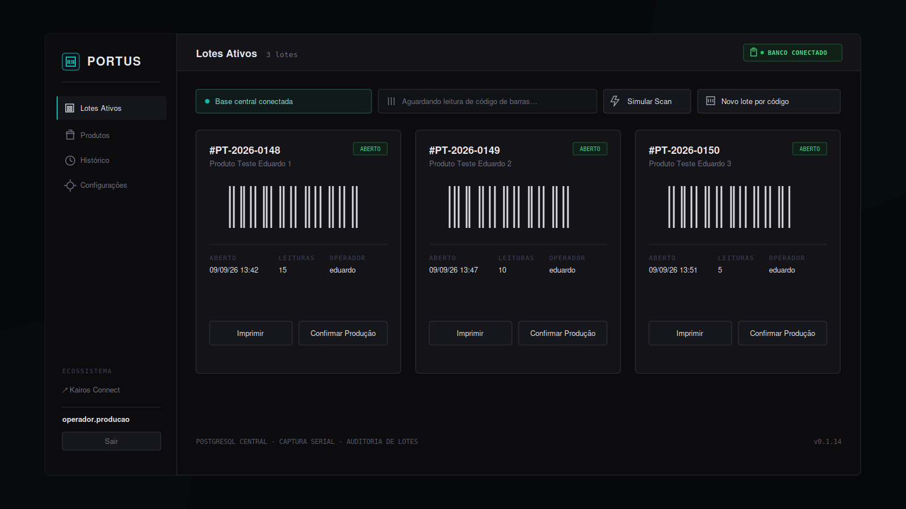
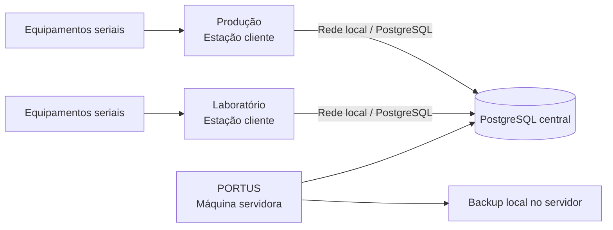

# PORTUS



**Captura industrial, rastreabilidade de leituras e gestão centralizada de lotes.**

O PORTUS é um aplicativo desktop para ambientes de **Produção e Laboratório**. Integra a leitura de equipamentos por porta serial, identifica responsáveis e computadores, acompanha o ciclo de vida dos lotes e mantém um histórico operacional compartilhado em **PostgreSQL**.

A aplicação foi projetada para instalações Windows com uma **máquina servidora** e **estações clientes**. Toda a operação dos lotes, sessões e leituras utiliza a base central; as estações não precisam instalar PostgreSQL.

> **Status:** desenvolvimento ativo. A instalação, os equipamentos físicos, as rotinas de backup e o fechamento operacional exigem homologação na rede industrial de destino.

## Funcionalidades

- **Leitura de equipamentos:** captura de dados de até seis equipamentos seriais, incluindo cenários de protocolo passivo e Modbus RTU.
- **Identificação e rastreabilidade:** registro do lote, equipamento, leitura, data/hora, estação e usuário responsável.
- **Produção e Laboratório:** acesso por perfis e setores, com confirmações de encerramento por ambas as áreas.
- **Códigos de barras:** abertura e localização de lotes por scanner, com ambiente de simulação.
- **PostgreSQL central:** persistência compartilhada, migrations e controles de acesso.
- **Configuração assistida:** escolha explícita entre servidor central e estação cliente no primeiro acesso.
- **Histórico e relatórios:** impressão de registros e exportação de relatórios CSV/XLSX.
- **XLSX independente do Office:** geração nativa de planilhas formatadas, sem Microsoft Excel ou automação COM.
- **Backup centralizado:** operação de backup restrita à máquina configurada como servidor.
- **Distribuição Windows:** instalador NSIS, desinstalador integrado e verificação de atualizações publicadas.

## Arquitetura


```mermaid
flowchart LR
    P["Produção<br/>Estação cliente"] -->|Rede local / PostgreSQL| DB[("PostgreSQL central")]
    L["Laboratório<br/>Estação cliente"] -->|Rede local / PostgreSQL| DB
    S["PORTUS<br/>Máquina servidora"] --> DB
    EP["Equipamentos seriais"] --> P
    EL["Equipamentos seriais"] --> L
    S --> B["Backup local no servidor"]
```

O frontend React comunica-se com o processo principal do Electron por **IPC/preload**. A conexão ao PostgreSQL e os procedimentos operacionais são executados no processo principal; credenciais não são fornecidas diretamente à interface React.

| Camada | Tecnologias |
|---|---|
| Desktop | Electron |
| Interface | React, TypeScript, Vite, Lucide |
| Integração industrial | serialport, protocolos seriais, Modbus RTU |
| Backend local | Node.js, handlers IPC, validação Zod |
| Dados operacionais | PostgreSQL, driver `pg` |
| Testes | Vitest e testes SQL |
| Instalação Windows | electron-builder, NSIS e PowerShell |

## Primeira instalação

### 1. Escolha a função de cada computador

Na primeira abertura, o assistente solicita uma das opções:

| Tipo de máquina | Comportamento |
|---|---|
| **Servidor central** | Detecta as ferramentas PostgreSQL, prepara ou valida a base e registra esta máquina como servidor |
| **Estação cliente** | Solicita o IPv4 da máquina central e o setor (**Produção** ou **Laboratório**), valida a conexão e registra a estação |

**Somente o servidor precisa ter PostgreSQL instalado.** A máquina cliente não instala nem executa o servidor PostgreSQL.

### 2. Prepare a máquina servidora

Instale o PostgreSQL no Windows e mantenha seu serviço em execução. Configure o acesso das estações autorizadas na rede local:

- `postgresql.conf`: escuta nas interfaces necessárias;
- `pg_hba.conf`: autenticação apenas para usuários e endereços autorizados;
- Firewall do Windows: libere a porta PostgreSQL somente na rede confiável.

A porta padrão do PostgreSQL é **5432**. Evite exposição direta dessa porta à internet.

Para preparar manualmente a base usando os scripts do projeto:

```powershell
Set-ExecutionPolicy -Scope Process Bypass
.\database\install-portus-database.ps1
```

Também é possível abrir o utilitário visual de banco incluído na instalação do PORTUS:

```text
C:\Program Files\Portus\resources\database\portus-db-utility.bat
```

O utilitário identifica instalações PostgreSQL locais e disponibiliza procedimentos de validação e manutenção.

Consulte [database/README.md](database/README.md) para os comandos específicos de instalação, migrations, conexão e diagnóstico.

### 3. Configure as estações clientes

No assistente inicial, selecione **Estação cliente**, informe o IPv4 da máquina servidora e escolha **Produção** ou **Laboratório**. O aplicativo valida a conexão antes de liberar a utilização.

Os erros de conexão exibem uma mensagem compreensível e um **relatório técnico** com etapa, horário, IP, porta, código e causa do erro, quando disponíveis. As credenciais são ocultadas.

As configurações locais de conexão ficam no perfil Windows, em `%LOCALAPPDATA%\PORTUS\`.

## Backup do banco

A opção **Fazer backup agora** e seus controles ficam desabilitados em estações clientes. O processo principal também bloqueia a execução manual fora da máquina configurada como **servidor central**.

No servidor, a rotina utiliza o utilitário oficial `pg_dump.exe` do PostgreSQL. Esse arquivo normalmente está em:

```text
C:\Program Files\PostgreSQL\18\bin\pg_dump.exe
```

> **Atenção:** o `pg_dump` faz parte das ferramentas da instalação PostgreSQL, não do instalador do PORTUS. A localização automática do executável e a geração de backups devem ser verificadas no servidor Windows de produção antes da implantação definitiva.

## Histórico, impressão e Excel

O histórico reúne leituras, sessões, responsáveis, estações e equipamentos vinculados ao lote. Os relatórios podem ser impressos ou exportados.

A exportação `.xlsx` é gerada **diretamente em Node.js**, sem exigir Microsoft Excel, COM ou PowerShell. O arquivo inclui cabeçalhos formatados, larguras de colunas, autofiltro e primeira linha congelada.

O suporte a arquivos XLSX não implica instalação de um aplicativo para visualizá-los. Para abrir o resultado, o usuário pode utilizar um leitor de planilhas compatível.

## Desenvolvimento

**Requisitos para desenvolvimento:** Node.js, npm e ambiente capaz de executar Electron. A geração do instalador NSIS deve ser validada no Windows.

```bash
git clone https://github.com/lenixeduardo/portus.git
cd portus
npm install
npm run dev
```

### Verificações

```bash
npm run typecheck
npm test
npm run build
npm run validate:release
```

Os testes que exigem uma instância PostgreSQL ou dispositivos reais dependem de um ambiente de teste apropriado. Para simular a captura serial:

```bash
npm run sim -- --port COM11 --preset balanca
npm run sim -- --port COM11 --preset ph --interval 2000
npm run sim:test
```

O guia completo de execução está em [docs/RUNNING.md](docs/RUNNING.md).

## Instalador e versionamento

No Windows:

```powershell
npm run typecheck
npm test
npm run package
```

O empacotamento gera um instalador no formato:

```text
PORTUS-Setup-<versão>-x64.exe
```

A versão apresentada no login é obtida do `package.json` durante a compilação do frontend. O comando `npm run package` executa uma etapa de incremento da versão antes do build.

O instalador inclui os scripts e o utilitário PostgreSQL. O NSIS registra a desinstalação no Windows. A remoção do aplicativo não deve eliminar automaticamente os dados operacionais armazenados no PostgreSQL.

A verificação de novas versões utiliza as **GitHub Releases** oficiais do repositório; a instalação da atualização permanece uma ação do operador.

## Estrutura do projeto

```text
build/               Ícones e recursos de empacotamento
database/
  migrations/        Evolução do esquema PostgreSQL
  seed/              Cadastros iniciais
  tests/             Testes de banco e procedimentos
docs/                Guias, ADRs e especificações
scripts/             Build, empacotamento e validações
src/
  main/              Electron, IPC, acesso ao banco e captura
  preload/           API de comunicação protegida
  renderer/          Interface React
  shared/            Contratos e tipos compartilhados
tools/               Simulador de equipamentos
```

## Documentação técnica

- [Banco de dados e instalação](database/README.md)
- [Baseline do PostgreSQL](docs/PORTUS-DATABASE-BASELINE.md)
- [Arquitetura de autoridade central](docs/ADR-001-lot-service-authority.md)
- [Especificação do Laboratório](docs/PORTUS-LABORATORIO-SPEC.md)
- [Guia de execução](docs/RUNNING.md)
- [Empacotamento Windows](docs/PACKAGING.md)
- [Pendências de desenvolvimento](TODO.md)

## Homologação antes da operação

Antes da implantação definitiva, validar em ambiente real: comunicação com equipamentos e leitores de código de barras; permissões entre Produção e Laboratório; abertura e fechamento de lotes; backup e restauração; exportação de arquivos XLSX em máquinas sem Office; falhas de rede; atualização e desinstalação do aplicativo.

---

**PORTUS** · Gestão e rastreabilidade de operações industriais · 2026
