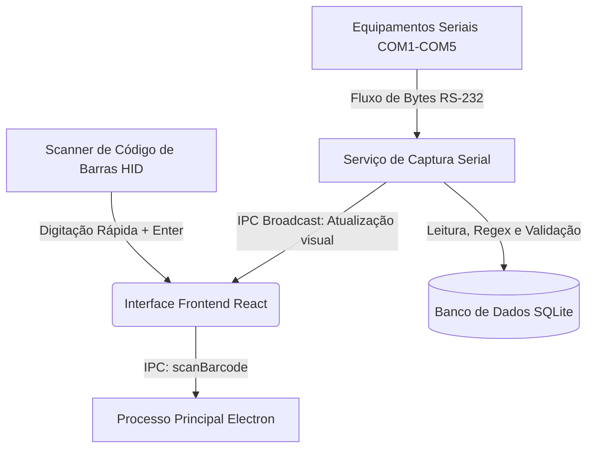

# Manual Técnico e Guia de Operações — PORTUS

Este documento descreve detalhadamente todos os modos, métodos e o fluxo técnico das rotinas de leitura de dados de equipamentos industriais e de códigos de barras pelo operador no sistema **PORTUS**.

---

## 🗺️ Índice
1. [Visão Geral da Arquitetura de Leitura](#1-visão-geral-da-arquitetura-de-leitura)
2. [Autenticação e Login do Operador](#2-autenticação-e-login-do-operador)
   * [2.1 Login via Credenciais Manuais](#21-login-via-credenciais-manuais)
   * [2.2 Login via Código de Barras (Crachá/Badge)](#22-login-via-código-de-barras-crachábadge)
3. [Modos de Abertura e Gestão de Lotes (Código de Barras)](#3-modos-de-abertura-e-gestão-de-lotes-código-de-barras)
   * [3.1 Entrada Manual e Criação de Lote](#31-entrada-manual-e-criação-de-lote)
   * [3.2 Leitura Direta Automática (Modo Scanner HID)](#32-leitura-direta-automática-modo-scanner-hid)
   * [3.3 Extração e Parser Regex do Código de Barras](#33-extração-e-parser-regex-do-código-de-barras)
4. [Captura de Dados via Porta Serial (Equipamentos)](#4-captura-de-dados-via-porta-serial-equipamentos)
   * [4.1 Ciclo de Vida da Conexão Serial](#41-ciclo-de-vida-da-conexão-serial)
   * [4.2 Tolerância a Falhas e Retry com Backoff](#42-tolerância-a-falhas-e-retry-com-backoff)
   * [4.3 Redirecionamento para Porta Reserva (Fallback)](#43-redirecionamento-para-porta-reserva-fallback)
   * [4.4 Auto-Desativação de Segurança (Fail-Safe)](#44-auto-desativação-de-segurança-fail-safe)
5. [Processamento e Normalização dos Dados Lidos](#5-processamento-e-normalização-dos-dados-lidos)
   * [5.1 Sincronização e Delimitadores de Linha](#51-sincronização-e-delimitadores-de-linha)
   * [5.2 Filtragem por Expressão Regular](#52-filtragem-por-expressão-regular)
   * [5.3 Normalização de Valores Decimais](#53-normalização-de-valores-decimais)
6. [Interface e Feedback Visual (CaptureModal)](#6-interface-e-feedback-visual-capturemodal)

---

## 1. Visão Geral da Arquitetura de Leitura

O sistema PORTUS realiza a interface entre dois tipos de dispositivos periféricos de hardware:
1. **Leitores de Código de Barras:** Operam tipicamente sob o protocolo **HID (Human Interface Device)** emulando um teclado físico USB. Eles capturam os dados de lotes, produtos ou crachás de operadores e enviam como comandos de digitação rápidos seguidos do sinal de `Enter`.
2. **Equipamentos de Laboratório/Processo (pH-metro, Balança, Refratômetro, etc):** Comunicam-se de forma assíncrona por **portas de comunicação serial (RS-232 / COM)** mapeadas em slots específicos de leitura. Os dados lidos são interpretados pelo back-end em Electron e persistidos de forma segura no SQLite.



---

## 2. Autenticação e Login do Operador

O aplicativo possui uma tela de login dedicada que impede o acesso não autorizado à área de medição. A autenticação suporta dois formatos de operação pelo operador:

### 2.1 Login via Credenciais Manuais
O operador clica nos campos, insere manualmente sua **Identificação** (User ID) e a **Senha** de acesso, clicando no botão **Entrar**. O sistema valida as credenciais contra a tabela `users` do banco SQLite utilizando criptografia `bcrypt`.

### 2.2 Login via Código de Barras (Crachá/Badge)
Para agilizar o processo no chão de fábrica, o operador pode utilizar o leitor de código de barras para se autenticar:
* **Mecanismo:** O leitor de código de barras HID emula o teclado físico. Com o foco do cursor posicionado automaticamente no input de **Identificação** (autoFocus ativo por padrão), o operador escaneia o código impresso em seu crachá.
* **Processo:** O scanner digita o identificador do operador em milissegundos e envia o caractere de quebra de linha (`Enter`). O formulário do frontend detecta o evento de submit do teclado e envia a autenticação para o back-end via canal IPC `auth:login`.
* *Nota:* Para este modo de login instantâneo ("single-scan"), a senha do operador deve estar configurada como vazia ou nula no sistema para evitar a digitação manual secundária, ou o leitor de código de barras deve ser programado para digitar a string do usuário, um caractere `Tab`, a senha e por fim o `Enter`.

---

## 3. Modos de Abertura e Gestão de Lotes (Código de Barras)

Para que qualquer medição seja iniciada, as leituras devem estar vinculadas a um **Lote Ativo** (Batch). Existem dois métodos para abrir ou selecionar um lote:

### 3.1 Entrada Manual e Criação de Lote
Disponível para usuários com perfil de **Administrador**.
1. O administrador clica em **"Novo Lote por Código de Barras"**.
2. Um modal se abre com um campo de digitação manual.
3. O administrador digita o código do lote (ou escaneia) e clica em **Pesquisar/Criar**.
4. O sistema processa o código e cria/associa o lote, fechando o modal e carregando o painel de captura.

### 3.2 Leitura Direta Automática (Modo Scanner HID)
Disponível para **todos os operadores** diretamente a partir do painel (Dashboard). Este é o modo mais rápido e recomendado para operação contínua.
1. O operador simplesmente posiciona o cursor em qualquer parte da tela principal (a captura global de teclas via hook `useBarcodeScanner` monitora digitações em alta velocidade).
2. O operador aponta o leitor físico e escaneia o código de barras impresso na ordem de produção.
3. O sistema bloqueia a interface temporariamente, detecta o padrão de entrada em milissegundos e envia o código para análise no back-end.
4. **Resolução de Lote:**
   * **Se o lote já estiver aberto no sistema:** O painel o seleciona e abre o painel de captura imediatamente.
   * **Se o lote não existir:** O sistema extrai o produto e o código, insere o novo lote como **ABERTO** na base de dados de forma silenciosa e inicia a captura serial das portas de medição sem qualquer intervenção ou clique do operador.

### 3.3 Extração e Parser Regex do Código de Barras
A validação automática das leituras de código de barras utiliza uma regex configurável no menu de Configurações (chave `barcode_regex`). O comportamento padrão utiliza grupos nomeados para separar a identificação do Produto da identificação do Lote:

* **Padrão Padrão:** `^(?<product>.+)-(?<batch_code>[^-]+)$`
* **Exemplo de Funcionamento:**
  Ao ler o código de barras `Tinta Latex Premium-2026-0089`:
  * Grupo `product` = `Tinta Latex Premium` (usado para localizar ou criar o produto).
  * Grupo `batch_code` = `2026-0089` (usado para gerar o código do lote).

> [!WARNING]
> Se o limite de lotes abertos configurado (padrão: 6) for atingido, a criação automática via leitor de código de barras retornará um erro visual informando ao operador que ele deve finalizar um lote existente antes de prosseguir.

---

## 4. Captura de Dados via Porta Serial (Equipamentos)

Uma vez que o lote é selecionado/criado, a janela **"Captura em andamento"** é exibida e o processo serial é iniciado em segundo plano.

### 4.1 Ciclo de Vida da Conexão Serial
O back-end varre os equipamentos cadastrados na tabela `equipments` e inicia conexões em paralelo nas portas físicas informadas (ex: `COM1`, `COM2`, `/dev/ttyUSB0`):

```
[Início] ➔ Instancia Portas RS-232 ➔ Tenta Conectar ➔ Loop de Escuta (Data) ➔ Grava Leituras ➔ Timeout/Fim ➔ Fecha Portas
```

### 4.2 Tolerância a Falhas e Retry com Backoff
A abertura de drivers de portas COM pode sofrer com instabilidades elétricas ou portas bloqueadas temporariamente por outros processos do SO.
* Ao abrir cada porta serial, o sistema executa **até 3 tentativas de conexão**.
* Entre cada falha, aplica-se um **backoff exponencial** de `100ms * 2^tentativa` (100ms, 200ms e 400ms) para dar tempo de liberação da linha física.
* A abertura é protegida por um timeout de segurança de 5 segundos. Se a porta travar ou demorar a responder, o processo não congela e segue adiante.

### 4.3 Redirecionamento para Porta Reserva (Fallback)
Se após as 3 tentativas a conexão na porta COM configurada falhar, o sistema aciona o modo de contingência:
* Ele busca na tabela de equipamentos se existe o equipamento cadastrado no slot 6 com o nome **"Reserva"**.
* Caso exista e tenha uma porta diferente configurada (ex: `COM6`), o sistema redireciona a escuta daquele slot para a porta reserva em tempo de execução de forma transparente, marcando internamente o slot com o indicador de que utilizou o fallback (`usedFallback: true`).

### 4.4 Auto-Desativação de Segurança (Fail-Safe)
Se a conexão falhar tanto na porta principal quanto na de fallback:
1. O equipamento que apresentou erro é **automaticamente desabilitado** no banco de dados (`enabled = 0`).
2. Isso impede que capturas futuras tentem acessar a porta defeituosa, evitando lentidão no sistema do cliente.
3. O slot correspondente na tela de captura fica marcado em **vermelho (Status: Erro)**, alertando o operador visualmente para revisar o cabo ou ligar o aparelho.

---

## 5. Processamento e Normalização dos Dados Lidos

Os dados recebidos via interface serial são strings brutas enviadas continuamente pelos equipamentos de medição. O sistema realiza as seguintes etapas de saneamento antes de gravar o registro final:

### 5.1 Sincronização e Delimitadores de Linha
Os dados podem vir fragmentados na transmissão serial. O sistema acumula os bytes recebidos em um buffer de memória local limitando a **100KB** para evitar estouro de memória. A extração de leituras completas é realizada dividindo o texto pelos delimitadores configurados:
* **LF (Line Feed):** `\n` (Padrão)
* **CR (Carriage Return):** `\r`
* **CRLF:** `\r\n`

*Flush de Fechamento:* Ao encerrar a sessão de captura (seja por timeout do lote ou interrupção do operador), qualquer leitura restante no buffer que não tenha o delimitador final é descarregada ("flush") e gravada mesmo assim, garantindo que a última medição não se perca.

### 5.2 Filtragem por Expressão Regular
Cada equipamento pode ter uma Regex de parsing configurada no banco (ex: espectrofotômetro que envia múltiplos valores em uma única linha de texto).
* O sistema aplica a regex na linha lida e procura pelo grupo nomeado `(?<value>...)`.
* Caso a expressão regular não encontre correspondência, a leitura ainda assim é gravada para fins de auditoria, e o motivo do erro (`parse_failure_reason = 'no_match'`) é armazenado juntamente com a regex utilizada e a string original bruta.

### 5.3 Normalização de Valores Decimais
Equipamentos industriais de origens diferentes podem enviar valores decimais utilizando vírgula (padrão latino/brasileiro) ou ponto (padrão anglo-saxão).
* O parser do PORTUS automaticamente identifica o uso de vírgula decimal (ex: `12,34`) e a converte para o formato de ponto flutuante padrão de programação (ex: `12.34`).
* Isso permite a plotagem consistente de gráficos e exportação coerente em arquivos CSV.

---

## 6. Interface e Feedback Visual (CaptureModal)

Durante o processo de captura, a tela exibe um painel interativo contendo indicadores em tempo real para o operador:

| Status Visual | Cor do LED | Significado Operacional |
| :--- | :--- | :--- |
| **Aguardando leitura** | **Verde Claro** | Porta COM conectada com sucesso. Aguardando o envio do dado pelo equipamento físico. |
| **Leitura recebida** | **Azul Piscante** | Medição recebida e processada com sucesso. O valor numérico final é renderizado no card. |
| **Erro na porta** | **Vermelho** | Falha consecutiva de conexão ou erro de hardware na porta COM. |
| **Inativo** | **Cinza** | Equipamento desligado ou desabilitado nas configurações. |

No topo da janela, um **anel de progresso visual** mostra a contagem regressiva em segundos para o fim da sessão de captura configurada. O operador pode clicar em **"Cancelar Captura"** a qualquer momento para abortar as medições e manter as leituras já salvas.
