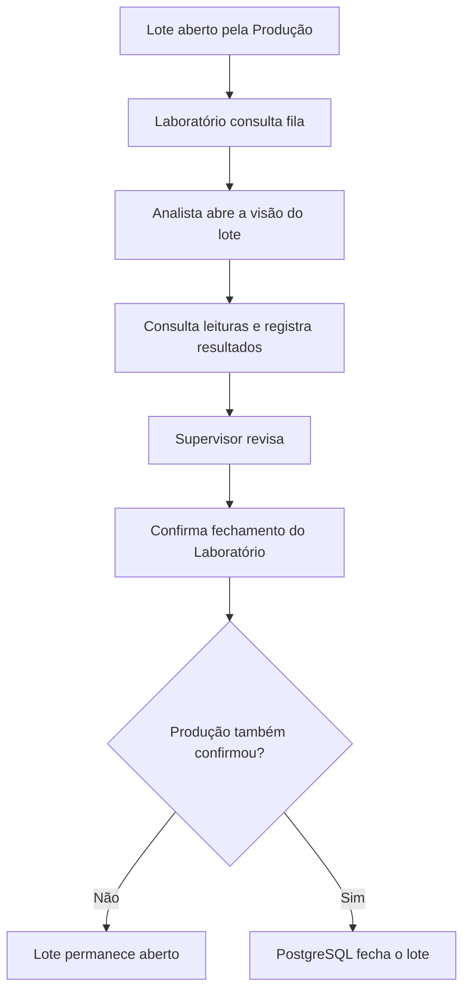

# PORTUS Visão Laboratório — Especificação Técnica

**Status:** proposta para validação  
**Aplicação:** novo cliente do ecossistema PORTUS  
**Integração:** PostgreSQL central compartilhado  
**Dependência:** `PORTUS-DATABASE-BASELINE.md` e `PORTUS_SPEC_TECNICO(1).md`

## 1. Objetivo

O PORTUS Visão Laboratório será a interface usada pelo setor de Laboratório para:

- visualizar lotes recebidos da Produção;
- executar a captura de leituras do Laboratório;
- consultar o histórico de captura;
- confirmar o fechamento do lote pelo Laboratório.

O escopo inicial não inclui cadastro de ensaios, resultados laboratoriais ou observações técnicas.

A aplicação não controla portas USB/serial. Essa responsabilidade permanece no PORTUS operacional.

## 2. Limites do produto

### Responsabilidades

- consumir a base PostgreSQL central;
- respeitar permissões por usuário, aplicação e setor;
- apresentar apenas lotes autorizados ao Laboratório;
- registrar as leituras da captura do Laboratório com auditoria;
- confirmar o fechamento laboratorial;
- exibir claramente quando o lote ainda aguarda a Produção.

### Fora do escopo inicial

- comunicação direta com equipamentos seriais;
- alteração arbitrária do status global do lote;
- exclusão física de leituras ou resultados;
- limite global de lotes abertos;
- sincronização offline com posterior reconciliação;
- Kafka, filas, CQRS, CDC ou Event Sourcing.

## 3. Perfis e permissões

O Laboratório terá somente dois perfis operacionais:

| Perfil | Permissões principais |
|---|---|
| Captura | consultar lotes autorizados, consultar leituras e executar captura do Laboratório |
| Fechamento | consultar lotes, consultar histórico e confirmar o fechamento do Laboratório |

O perfil de Fechamento pode acumular a permissão de Captura quando isso for necessário na operação, mas a confirmação laboratorial deve ser uma permissão explícita.

Administrador e Master continuam sendo perfis de infraestrutura da plataforma, não perfis operacionais do Laboratório.

Permissões recomendadas para a aplicação:

- `read`;
- `capture`;
- `confirm_laboratory`;
- `move`, somente se o processo exigir mudança de etapa;
- `export`, se a exportação for liberada.

A autorização deve ser validada no PostgreSQL. O cliente não deve decidir sozinho se uma ação é permitida.

## 4. Fluxo principal



O cliente nunca deve executar `UPDATE batches` diretamente. A confirmação deve chamar `confirm_laboratory_close`.

## 5. Visões da aplicação

### 5.1 Login

- autenticação contra o mecanismo definido pelo ambiente central;
- identificação do usuário, aplicação e setor;
- bloqueio de usuários inativos;
- mensagem específica para ausência de permissão no Laboratório.

### 5.2 Fila de lotes

Exibir:

- código do lote;
- produto;
- etapa atual;
- data/hora de abertura;
- operador de origem;
- quantidade de leituras;
- estado da confirmação da Produção;
- estado da confirmação do Laboratório;
- indicador de pendência ou inconsistência.

Filtros mínimos:

- lote;
- produto;
- etapa;
- status;
- período;
- confirmação da Produção;
- confirmação do Laboratório.

### 5.3 Detalhe do lote

Seções:

1. identificação do lote;
2. status e etapa;
3. leituras capturadas;
4. resultados laboratoriais;
5. observações;
6. histórico de alterações;
7. ações disponíveis para o usuário.

O detalhe deve deixar evidente que “confirmar Laboratório” não significa necessariamente fechar o lote globalmente.

### 5.4 Captura do Laboratório

A tela de captura deve reutilizar o fluxo de captura serial do PORTUS, respeitando:

- equipamentos autorizados para o setor Laboratório;
- sessões de captura vinculadas ao lote;
- leituras brutas e parseadas;
- erros de comunicação e parsing;
- encerramento ou cancelamento da sessão.

### 5.5 Confirmação do Laboratório

Antes da confirmação, mostrar:

- leituras registradas;
- leituras incompletas ou com erro;
- usuário que fará a confirmação;
- confirmação já registrada, se houver;
- impacto esperado: “o lote fechará somente se a Produção também tiver confirmado”.

## 6. Modelo de dados

A primeira versão reutiliza exclusivamente as entidades existentes:

- `users`;
- `applications`;
- `sectors`;
- `products`;
- `batches`;
- `capture_sessions`;
- `readings`;
- `batch_history`.

Para resultados específicos do Laboratório, criar em uma migration posterior:


A criação de uma entidade específica para resultados laboratoriais fica fora do escopo inicial e poderá ser avaliada em uma etapa futura.

## 7. Funções de domínio

Funções já existentes e obrigatórias:

- `portus_assert_permission`;
- `confirm_laboratory_close`;
- `portus_record_batch_history`.

Funções novas recomendadas:

- `get_laboratory_batch_queue`;
- `get_laboratory_batch_detail`;
- `register_laboratory_result`;
- `update_laboratory_result`;
- `cancel_laboratory_result`;
- `validate_laboratory_batch_for_close`.

As funções devem:

- validar usuário, aplicação e setor;
- usar transação;
- bloquear a linha do lote com `SELECT ... FOR UPDATE` quando necessário;
- registrar histórico;
- ser idempotentes quando a operação for repetida;
- impedir confirmação quando houver requisitos obrigatórios pendentes.

## 8. Contrato de aplicação

A aplicação deve ser registrada na tabela `applications` com código próprio, recomendado:

```text
PORTUS_LABORATORY
```

O código definitivo deve ser decidido antes da migration de seed.

A API do cliente deve encapsular:

- conexão e pool PostgreSQL;
- timeout;
- tratamento de indisponibilidade;
- identificação do setor `LABORATORY`;
- chamadas às funções de domínio;
- conversão de erros PostgreSQL para mensagens operacionais.

O cliente não deve receber credenciais administrativas nem expor a URL do banco ao frontend.

## 9. Regras de fechamento

1. O Laboratório só pode confirmar pela função `confirm_laboratory_close`.
2. A confirmação laboratorial deve ser registrada uma única vez por usuário/ação lógica.
3. Repetição da confirmação deve ser idempotente.
4. Se a Produção ainda não confirmou, o lote permanece `open`.
5. O lote só passa a `closed` quando ambas as confirmações estiverem registradas.
6. O fechamento deve incrementar `version` e registrar `batch_history`.
7. O cliente deve atualizar a tela após a resposta do PostgreSQL.

## 10. Segurança e operação

- conexão central obrigatória para escrita;
- nenhum modo offline para confirmação ou registro de resultado;
- consultas podem exibir aviso de indisponibilidade, mas não devem inventar estado;
- logs não podem registrar senha, URL completa ou dados sensíveis;
- permissões devem ser aplicadas simultaneamente ao usuário, aplicação e setor;
- toda alteração deve possuir usuário, timestamp e origem.

## 11. Critérios de aceite

O PORTUS Visão Laboratório será aceito quando:

- autenticar usuário autorizado do setor Laboratório;
- listar somente lotes permitidos;
- consultar leituras centralizadas;
- executar captura do Laboratório com auditoria;
- impedir alteração direta de status;
- confirmar o Laboratório pela função de domínio;
- manter o lote aberto quando a Produção não confirmou;
- fechar o lote somente após as duas confirmações;
- suportar repetição idempotente da confirmação;
- exibir histórico completo;
- negar operação para usuário, aplicação ou setor sem permissão;
- tratar indisponibilidade da central sem fallback de escrita local;
- passar por teste concorrente de confirmação.

## 12. Plano de implementação

### Fase A — Fundação

- registrar a aplicação `PORTUS_LABORATORY`;
- definir permissões do setor Laboratório;
- criar migration de `laboratory_results`;
- criar funções de consulta e registro;
- criar testes de autorização e idempotência.

### Fase B — Cliente

- criar shell de autenticação;
- implementar fila de lotes;
- implementar detalhe e histórico;
- implementar registro de resultados;
- implementar revisão e confirmação.

### Fase C — Homologação

- validar usuário, aplicação e setor;
- validar mapeamento de produtos;
- testar lote sem confirmação da Produção;
- testar fechamento simultâneo;
- testar indisponibilidade do PostgreSQL;
- testar auditoria e exportação.

## 13. Decisões ainda necessárias

Antes do desenvolvimento, o responsável pelo processo deve confirmar:

1. quais equipamentos pertencem ao setor Laboratório;
2. quais leituras são obrigatórias antes da confirmação;
3. quais perfis terão permissão de captura e de fechamento;
4. se o perfil de Fechamento também poderá capturar;
5. se haverá anexos ou assinatura digital em etapa futura;
6. se o cliente será Electron, web ou ambos;
7. o código definitivo da aplicação no PostgreSQL.
